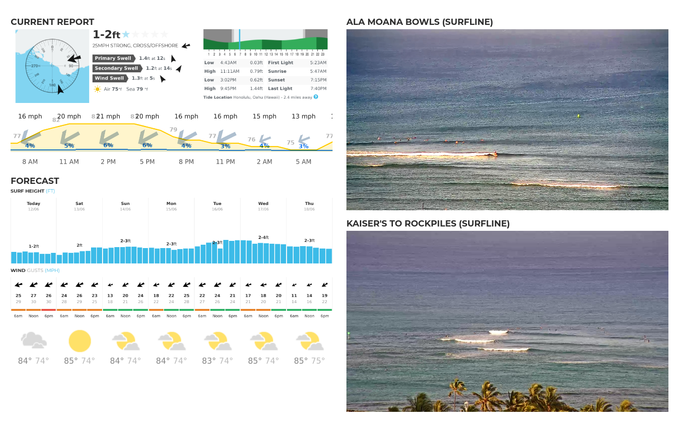

# Spindrift

Surf report kiosk built on an [Apple Pi](https://imgur.com/gallery/4I8jm).

<div align="center">
  <kbd>
    
  </kbd>
</div>

## Description

Spindrift displays a dashboard of the following components, refreshed hourly:
- Surf forecast from Magicseaweed
- Weather forecast from Google
- Live cam streams from user-specified sources (e.g., Surfline)

Here's how it works:
- Fetches hourly forecast data with Puppeteer (headless Chrome) scheduled in a cron job
- Renders the forecast, along with live cam streams, in Chrome running in kiosk mode and controlled by DevTools Protocol on a standalone X server
- Runs on a "headless" Raspberry Pi controlled remotely via SSH
- (Optional) Displays on an old, beautiful, hacked Apple iMac G4 17" 1440x900 px

## Getting Started

### Dependencies

If needed, [install Raspbian](https://github.com/noperator/guides/blob/master/install_raspbian.md).

### Install

Clone this repo and run the installer script.
```
git clone https://github.com/noperator/spindrift && cd spindrift
./install.sh
```

This'll do a few things:
- Install dependencies
  - [X server](https://github.com/freedesktop/xorg-xserver)
  - [Chromium](https://github.com/chromium/chromium)
  - [jq](https://github.com/stedolan/jq)
  - [Puppeteer](https://github.com/puppeteer/puppeteer)
  - [WebSocat](https://github.com/vi/websocat)
- Schedule cron jobs
  - Start at boot
  - Schedule hourly forecast refresh
  - Save power while display is not in use

### Configure

Next, specify your surf spot and weather location in the `config/.env` config file. For example, pull the string `Ala-Moana-Surf-Report/661/` from Ala Moana's surf forecast URL `https://magicseaweed.com/Ala-Moana-Surf-Report/661/`.
```
export SPOT="Ala-Moana-Surf-Report/661/"
export LOCATION="Waikiki HI"
```

Finally, configure `config/streams.js` with the HLS live cam streams you'd like to display.
```
"priority": "1",
"url":      "<URL>",
"title":    "Ala Moana Bowls",
"source":   "Surfline"
```

### Executing

The kiosk will launch automatically when you boot the Raspberry Pi, but you can also start it manually:
```
./startx.sh
```

You can also manually refresh it:
```
./refresh.sh
```

### Troubleshooting

If needed, fix `startx` error, "Only console users are allowed to run the X server."
```
sudo sed -i -E 's/(allowed_users=)console/\1anybody/' /etc/X11/Xwrapper.config
```

## Todo

- [ ] Turn off display signal while sleeping, rather than blanking it
- [x] Add weather report
- [x] Load backup streams in order of preference
- [ ] Merge screenshot scripts
- [ ] Consolidate config files into a single JavaScript file, if possible
